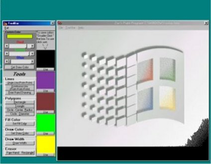



## ZEO Paint

### Description

!!!Please Leave Comments!!! This Prog is a painting program able to draw lines, free-hand, point to point to point, circles, rectangles, triangles, erase free-hand, selected areas, saves and loads pics, floodfill objects, create custom colors, save colors.
 
### More Info
 
Paint

None That I know Of

             |
---                |---
**Submitted On**   |2001-08-02 09:43:32
**By**             |[ZEO](https://github.com/Planet-Source-Code/PSCIndex/blob/master/ByAuthor/zeo.md)
**Level**          |Beginner
**User Rating**    |3.4 (17 globes from 5 users)
**Compatibility**  |VB 6\.0
**Category**       |[Files/ File Controls/ Input/ Output](https://github.com/Planet-Source-Code/PSCIndex/blob/master/ByCategory/files-file-controls-input-output__1-3.md)
**World**          |[Visual Basic](https://github.com/Planet-Source-Code/PSCIndex/blob/master/ByWorld/visual-basic.md)
**Archive File**   |[ZEO Paint23956822001\.zip](https://github.com/Planet-Source-Code/zeo-zeo-paint__1-25778/archive/master.zip)

